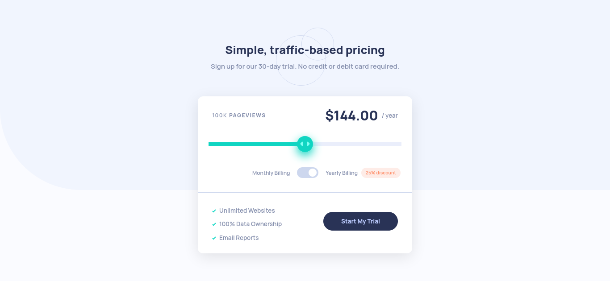

# Frontend Mentor Challenge - Interactive Pricing Component

This is my implementation of Frontend Mentor's ["Interactive Pricing Component challenge"](https://www.frontendmentor.io/challenges/interactive-pricing-component-t0m8PIyY8).

## Overview

### The challenge

Users should be able to:

- View the optimal layout for the app depending on their device's screen size
- See hover states for all interactive elements on the page
- Use the slider and toggle to see prices for different page view numbers

### Screenshot



### Links

...

## My Process

### Built With...

- HTML5 Markup
- HTML Data Attributes
- CSS
  - Flexbox
  - CSS Grid
  - Mobile-First
  - Block-Element-Modifier Naming (BEM)
- Javascript ES6

### What I Learned...

- There's no easy way to style the range slider. It takes a very creative use of pseudo-selectors and browser-specific pseudo-elements, like...
  - `-webkit-slider-thumb` and `-webkit-slider-runnable-track` on Webkit-based browsers like Chrome and recent versions of Microsoft Edge.
  - `-moz-range-thumb` and `-moz-range-track` on Firefox.
  - `-moz-range-progress` for styling to the left of the thumb on Firefox, and a very creative use of Javascript and CSS variables to accomplish the same on other browsers. Initially, I tried dynamically setting the width of the `:after` pseudo-element of the slider using a data attribute. Unfortunately, right now, data attributes only work with the `content` CSS property.

Here's what I did to accomplish styling to the left of the thumb in a cross-browser fashion:

- In the Javascript code, whenever the price range input is adjusted, I set a variable in the price range styling equal to its value times 25% of the range's width:

```Javascript
  const priceRange = document.querySelector(".pricing__price-range");
  // ...
  const onPriceRangeInput = () => {
    priceRange.style.setProperty("--progress-width", `${priceRange.value * 25}%`);
    // ...
  };
  // ...
  window.addEventListener("DOMContentLoaded", () => {
    // Do the same here when the page is loaded.
    priceRange.style.setProperty("--progress-width", `${priceRange.value * 25}%`);

    // ...

    priceRange.addEventListener("input", onPriceRangeInput);

    // ...
  });
```

- Then, in the CSS, I set up an `:after` pseudo-element, in which the width is set to the `--progress-width` variable set by the JS code:

```CSS
  .pricing__price-range:after {
    content: "";
    position: absolute;
    top: 0px;
    left: 0px;
    width: var(--progress-width);
    height: 8px;
    background-color: var(--color-slider-bg);
  }
```

### Continued Development

I would like to look further into how to style sliders, and other input elements introduced in HTML5, and how limited I really am when it comes to using data attributes to affect CSS without Javascript.

## Author

By: Dennis Griffin

- https://dgdev1024.com
- Github: https://github.com/dgdev1024
- Frontend Mentor: https://frontendmentor.io/profile/dgdev1024
- Twitter: https://twitter.com/dgdev1024 (@dgdev1024)
